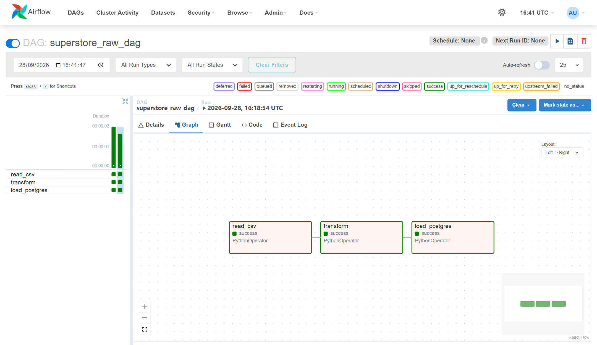
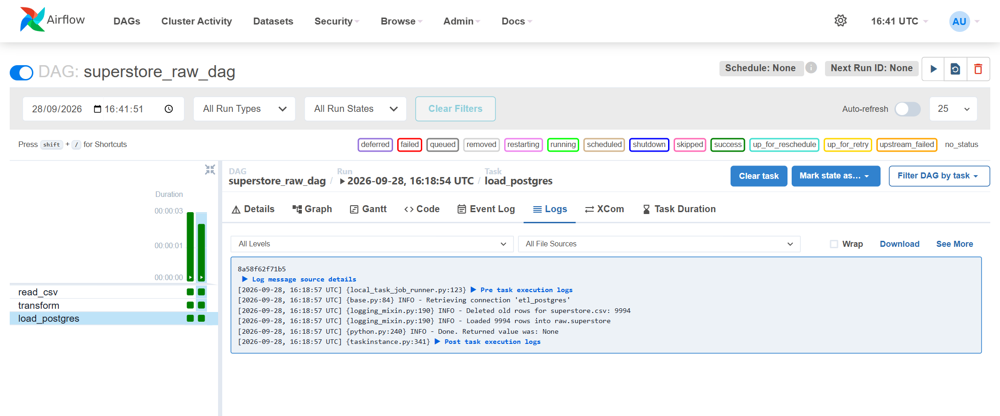

# ETL Airflow Project — data pipeline on Apache Airflow

[Русский](README.md) | **English**


A containerized ETL pipeline that loads sales data (Superstore) from CSV files, orchestrates processing with **Apache Airflow**, stores the results in **PostgreSQL** in raw → staging → mart layers, and serves the mart to **Power BI** for reporting.

```
CSV  →  Airflow (Python)  →  PostgreSQL (raw → staging → mart)  →  Power BI
```

---

## 🛠️ Tech stack

| Layer | Tool |
|---|---|
| Orchestration | Apache Airflow 2.10 (LocalExecutor) |
| Processing | Python 3 |
| Storage | PostgreSQL 16 |
| Infrastructure | Docker, Docker Compose |
| Reporting | Power BI |

---

## 🔄 Pipelines

### 🐘 `superstore_raw_dag` — load `superstore.csv` into the raw layer

```
read_csv  →  transform  →  load_postgres
```

| Task | What it does |
|---|---|
| `read_csv` | Checks that the file exists and its header matches the expected 21 columns; counts rows. |
| `transform` | Re-encodes cp1252 → UTF-8, converts headers to snake_case, adds `source_file` and `loaded_at` technical columns. |
| `load_postgres` | Replaces this file's rows in `raw.superstore`: `DELETE` and `COPY` run in a single transaction. |

- **Row count reconciliation** at every step: the DAG fails if the counts don't match.
- **All or nothing**: on error the transaction rolls back and existing data stays untouched.
- **Idempotent**: re-running doesn't duplicate data — 9994 rows deleted, 9994 loaded, the table still has 9994 rows.
- **No passwords in code**: the connection comes from the Airflow Connection `etl_postgres`.
- Project data lives in a dedicated `etl_data` database, separate from Airflow's own metadata database.

---

## 📂 Project structure

| Folder / file | Contents |
|---|---|
| [dags/](dags/) | Airflow DAG definitions |
| [input/](input/) | Source files (`superstore.csv`) |
| [output/](output/) | Intermediate files (re-encoded CSV before loading) |
| [archive/](archive/) | Archive of processed files |
| [docs/](docs/) | Screenshots |
| [docker-compose.yaml](docker-compose.yaml) | Airflow + PostgreSQL services |

---

## 📊 Data source: `superstore.csv`

The public Sample Superstore dataset: retail sales for 2014–2017.

| Property | Value |
|---|---|
| Encoding | cp1252 (Windows-1252), not UTF-8 |
| Delimiter | comma `,` |
| Line endings | CRLF (`\r\n`) |
| Rows | 9994 + header |
| Columns | 21 |
| Date format | M/D/YYYY without leading zeros (`6/9/2014` = June 9) |
| Quirks | 427 non-breaking spaces (`\xa0`) in text fields |

---

## 🚀 Getting started

**Prerequisites:** [Docker Desktop](https://www.docker.com/products/docker-desktop/) and `superstore.csv` in the `input/` folder.

```bash
# 1. Clone the repository
git clone https://github.com/aznrz/ETL_Airflow_Project.git
cd ETL_Airflow_Project

# 2. Start Airflow and PostgreSQL
docker compose up -d

# 3. Create the project database
docker compose exec postgres psql -U airflow -c "CREATE DATABASE etl_data;"

# 4. Create the etl_postgres connection in Airflow
docker compose exec airflow airflow connections add etl_postgres \
  --conn-type postgres --conn-host postgres --conn-port 5432 \
  --conn-schema etl_data --conn-login airflow --conn-password airflow

# 5. Get the generated admin password
docker compose exec airflow cat /opt/airflow/standalone_admin_password.txt
```

Open http://localhost:8080 and log in as `admin` with that password. Unpause `superstore_raw_dag` and trigger it. Check the result:

```bash
docker compose exec postgres psql -U airflow -d etl_data -c "SELECT COUNT(*) FROM raw.superstore;"
```

| Action | Command |
|---|---|
| Stop services | `docker compose down` |
| Container status | `docker compose ps` |
| Follow Airflow logs | `docker compose logs -f airflow` |

> ⚠️ Credentials in `docker-compose.yaml` and in the commands above are local development defaults. Do not reuse them in production.

---

## 🖼️ Screenshots

**DAG graph** — all three tasks completed successfully:



**`load_postgres` task log** — a re-run replaced 9994 rows instead of appending them:



---

## 🎯 Roadmap

- [x] Dockerized Airflow + PostgreSQL environment
- [x] CSV → PostgreSQL ETL DAG (raw layer) with idempotent loading
- [ ] Data layers: raw → staging → mart (star schema)
- [ ] Data quality checks before downstream processing
- [ ] Automatic processing of new files, without loading the same file twice
- [ ] Daily schedule
- [ ] Failure alerts in Telegram
- [ ] Power BI report on top of the mart layer

---

*ETL Airflow Project · last updated: 28.09.2026, 21:42 (Almaty, UTC+5)*
