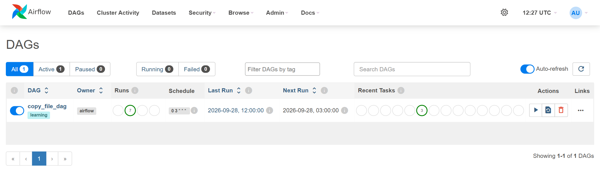

# ETL Airflow Project — пайплайн данных на Apache Airflow

**Русский** | [English](README.en.md)


ETL-пайплайн в Docker. Он принимает данные о сотрудниках из CSV-файлов, оркестрирует обработку через **Apache Airflow**, загружает результат в **PostgreSQL** и отдаёт его в **Power BI** для отчётности.

```
CSV / Excel  →  Airflow (Python)  →  PostgreSQL  →  Power BI
```

---

## 🛠️ Стек

| Слой | Инструмент |
|---|---|
| Оркестрация | Apache Airflow 2.10 (LocalExecutor) |
| Обработка | Python 3 |
| Хранилище | PostgreSQL 16 |
| Инфраструктура | Docker, Docker Compose |
| Отчётность | Power BI |

---

## 🔄 Пайплайны

### 📁 `copy_file_dag` — приём и архивирование файла

```
check_file  →  copy_to_archive  →  verify_copy
```

| Задача | Что делает |
|---|---|
| `check_file` | Проверяет, что исходный файл есть в `input/`. Если файла нет, пайплайн сразу останавливается. |
| `copy_to_archive` | Копирует файл в `archive/` с сохранением метаданных. |
| `verify_copy` | Сравнивает размеры исходного файла и копии, чтобы убедиться, что копия полная. |

### 🐘 `employees_to_postgres` — загрузка в хранилище *(в разработке)*

```
read_csv  →  transform  →  load_postgres
```

Читает `employees.csv`, очищает и преобразует данные, затем загружает их в отдельную базу PostgreSQL. Эта база не смешивается со служебной базой Airflow.

---

## 📂 Структура проекта

| Папка / файл | Что внутри |
|---|---|
| [dags/](dags/) | Описания DAG для Airflow |
| [input/](input/) | Исходные файлы (пример: `employees.csv`, 1000 строк) |
| [archive/](archive/) | Архивные копии обработанных файлов |
| [output/](output/) | Результаты обработки |
| [docker-compose.yaml](docker-compose.yaml) | Сервисы Airflow и PostgreSQL |

---

## 📊 Тестовые данные

`input/employees.csv` — 1000 строк, разделитель `;`:

```
id;name;department;salary
1;Azamat;IT;500000
2;Marat;Sales;400000
```

Отделы: IT, Sales, Finance, HR, Marketing, Logistics.

---

## 🚀 Запуск

**Что нужно:** [Docker Desktop](https://www.docker.com/products/docker-desktop/).

```bash
# 1. Клонировать репозиторий
git clone https://github.com/aznrz/ETL_Airflow_Project.git
cd ETL_Airflow_Project

# 2. Запустить Airflow и PostgreSQL
docker compose up -d

# 3. Получить сгенерированный пароль администратора
docker compose exec airflow cat /opt/airflow/standalone_admin_password.txt
```

Откройте http://localhost:8080 и войдите под логином `admin` с этим паролем. Включите `copy_file_dag` и запустите его вручную. После этого копия файла появится в `archive/`.

| Действие | Команда |
|---|---|
| Остановить сервисы | `docker compose down` |
| Статус контейнеров | `docker compose ps` |
| Логи Airflow | `docker compose logs -f airflow` |

> ⚠️ Логины и пароли в `docker-compose.yaml` — стандартные значения для локальной разработки. В продакшене их использовать нельзя.

---

## 🖼️ Скриншоты

**Список DAG** — `copy_file_dag` включён, расписание `0 3 * * *`, все запуски успешны:



**Граф DAG** — три задачи выполнились успешно:


**Лог задачи `verify_copy`** — размер копии совпал с оригиналом:


---

## 🎯 Дорожная карта

- [x] Окружение Airflow + PostgreSQL в Docker
- [x] DAG приёма и архивирования файла с проверкой
- [x] Ежедневное расписание (08:00 по Алматы)
- [ ] ETL-DAG: CSV → PostgreSQL (слой raw)
- [ ] Слои данных: raw → staging → mart
- [ ] Проверки качества данных перед загрузкой
- [ ] Автоматическая обработка новых файлов без повторной загрузки
- [ ] Уведомления об ошибках в Telegram
- [ ] Отчёт Power BI поверх витрины mart

---

*ETL Airflow Project · последнее обновление: 28.09.2026, 17:35 (Алматы, UTC+5)*
